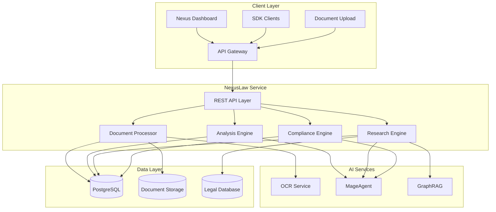
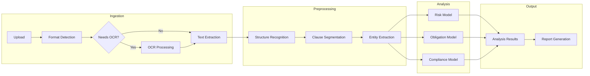
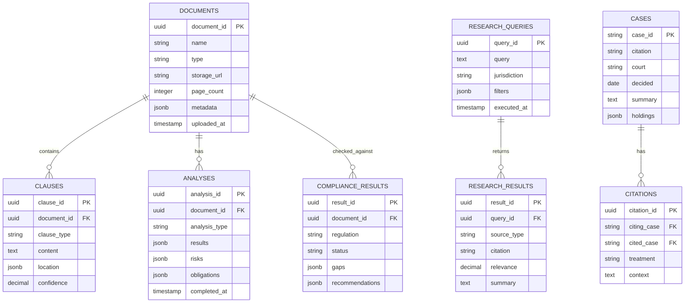
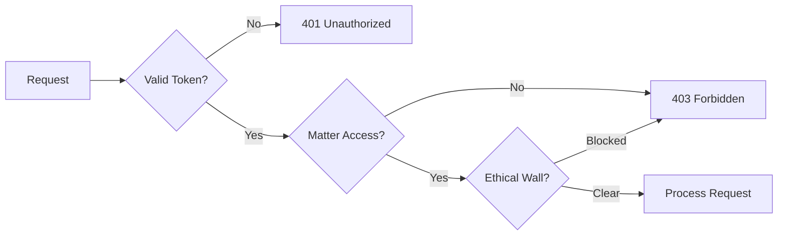

# NexusLaw Architecture

Technical architecture and system design for the AI-powered legal document analysis platform.

---

## System Overview



---

## Core Components

### 1. REST API Layer

| Endpoint | Method | Description |
|----------|--------|-------------|
| `/api/v1/documents/analyze` | POST | Analyze legal document |
| `/api/v1/documents/:id` | GET | Get analysis results |
| `/api/v1/research/query` | POST | Execute legal research |
| `/api/v1/citations/:caseId` | GET | Get citation network |
| `/api/v1/compliance/check` | POST | Run compliance check |
| `/api/v1/compliance/gaps` | GET | List compliance gaps |

### 2. Document Processor

Handles document ingestion and preprocessing.

**Capabilities:**
- Multi-format support (PDF, DOCX, images)
- OCR for scanned documents
- Structure recognition
- Clause segmentation

### 3. Analysis Engine

AI-powered document analysis.

**Analysis Types:**
- Risk identification
- Obligation extraction
- Key term extraction
- Missing clause detection
- Unusual term flagging

### 4. Research Engine

Legal research and citation analysis.

**Features:**
- Natural language queries
- Multi-jurisdiction support
- Citation network building
- Case similarity matching

### 5. Compliance Engine

Regulatory compliance checking.

**Frameworks:**
- GDPR
- CCPA
- HIPAA
- SOC2
- Industry-specific regulations

---

## Document Processing Pipeline



---

## Data Model



---

## NLP Model Architecture

### Document Analysis Model

**Architecture:**
- Legal-BERT base for understanding
- Custom clause classification head
- Named entity recognition for parties, dates, amounts
- Risk scoring ensemble

**Training Data:**
- 500K+ annotated contracts
- Multi-jurisdiction coverage
- Continuous learning from user feedback

### Research Model

**Architecture:**
- Dense retrieval for case similarity
- Cross-encoder for relevance ranking
- Citation graph neural network
- Summarization transformer

---

## Security Model

### Authentication
- Bearer token via Nexus API Gateway
- Document-level access tokens
- Client certificate support (enterprise)

### Authorization
- Matter-based access control
- Role-based permissions
- Client/matter confidentiality walls

### Data Protection
- Documents encrypted at rest (AES-256)
- Attorney-client privilege handling
- Data residency compliance
- Audit logging for all access



---

## Deployment Architecture

### Kubernetes Configuration

```yaml
apiVersion: apps/v1
kind: Deployment
metadata:
  name: nexus-law
  namespace: nexus-plugins
spec:
  replicas: 3
  selector:
    matchLabels:
      app: nexus-law
  template:
    spec:
      containers:
      - name: law-api
        image: adverant/nexus-law:1.0.0
        ports:
        - containerPort: 8080
        resources:
          requests:
            memory: "2Gi"
            cpu: "1000m"
          limits:
            memory: "4Gi"
            cpu: "2000m"
        livenessProbe:
          httpGet:
            path: /live
            port: 8080
        readinessProbe:
          httpGet:
            path: /ready
            port: 8080
      - name: ocr-service
        image: adverant/nexus-law-ocr:1.0.0
        resources:
          requests:
            memory: "1Gi"
            cpu: "500m"
          limits:
            memory: "2Gi"
            cpu: "1000m"
```

### Resource Allocation

| Component | CPU | Memory |
|-----------|-----|--------|
| API Server | 1000m-2000m | 2Gi-4Gi |
| OCR Service | 500m-1000m | 1Gi-2Gi |
| NLP Models | 2000m-4000m | 4Gi-8Gi |

---

## Integration Points

### Legal Databases

- Case law repositories
- Statutory databases
- Regulatory sources
- Secondary sources

### Document Management

- iManage
- NetDocuments
- SharePoint
- Custom integrations

### Event Bus

| Event | Payload | Subscribers |
|-------|---------|-------------|
| `law.document.analyzed` | Analysis results | Dashboard, Reports |
| `law.compliance.gap` | Gap details | Alerts, Remediation |
| `law.research.complete` | Research results | Matter, Notifications |

---

## Performance

### Rate Limits

| Tier | Requests/min | Documents/mo | Timeout |
|------|--------------|--------------|---------|
| Starter | 30 | 100 | 120s |
| Professional | 100 | 1,000 | 600s |
| Enterprise | Custom | Unlimited | Custom |

### Latency Targets

| Operation | Target | P99 |
|-----------|--------|-----|
| Document Analysis | 30s | 120s |
| Legal Research | 5s | 15s |
| Compliance Check | 15s | 60s |

### Processing Capacity

- **OCR**: 100 pages/minute
- **Analysis**: 50 contracts/minute
- **Research**: 1000 queries/minute

---

## Monitoring

### Metrics (Prometheus)

```
# Document metrics
law_documents_processed_total{type}
law_document_processing_seconds
law_ocr_accuracy

# Analysis metrics
law_risks_detected_total{severity}
law_analysis_accuracy

# Research metrics
law_research_queries_total
law_research_latency_seconds
```

### Alerting

| Alert | Condition | Severity |
|-------|-----------|----------|
| OCR Failure Rate | >5% | Critical |
| Analysis Accuracy Drop | <90% | Warning |
| Research Latency | P99 > 20s | Warning |

---

## Disaster Recovery

- **RPO**: 1 hour (documents), 24 hours (research cache)
- **RTO**: 30 minutes (API), 2 hours (full restore)
- **Document Backup**: Cross-region replication
- **Model Rollback**: Previous version available

---

## Next Steps

- [Quick Start Guide](./QUICKSTART.md) - Get started quickly
- [Use Cases](./USE-CASES.md) - Implementation scenarios
- [API Reference](./docs/api-reference/endpoints.md) - Complete docs
