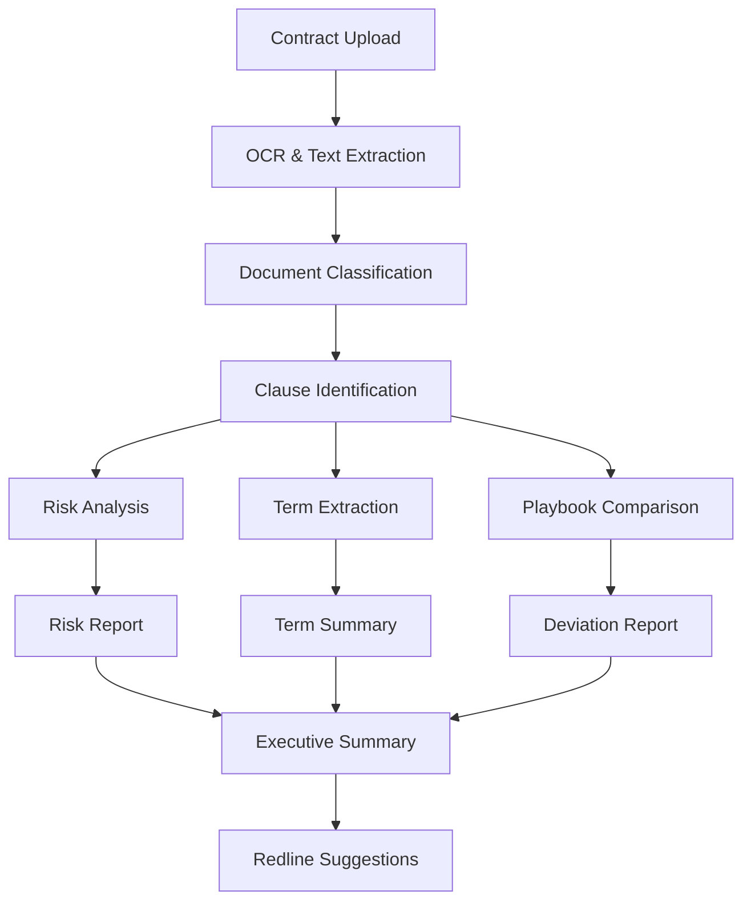
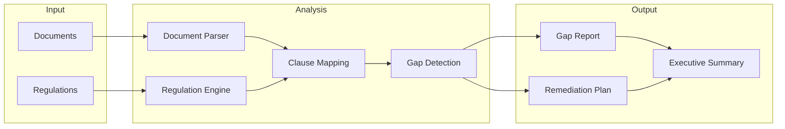

# NexusLaw Use Cases

Real-world implementation scenarios for AI-powered legal document analysis and research.

---

## Use Case 1: Automated Contract Review

### Problem

Legal teams spend 60% of time on routine contract review. Junior associates miss critical issues that senior attorneys catch.

### Solution

AI-powered contract analysis that identifies risks, extracts key terms, and recommends improvements.

### Implementation

```typescript
import { NexusClient } from '@adverant/nexus-sdk';

class ContractReviewService {
  private law;

  constructor(nexusClient: NexusClient) {
    this.law = nexusClient.plugin('nexus-law');
  }

  async reviewContract(documentUrl: string, contractType: string) {
    // Analyze the contract
    const analysis = await this.law.documents.analyze({
      documentUrl,
      documentType: contractType,
      analysisTypes: [
        'risks',
        'obligations',
        'key_terms',
        'missing_clauses',
        'unusual_terms'
      ],
      compareToPlaybook: true // Compare against company's standard playbook
    });

    // Get redline suggestions
    const redlines = await this.law.documents.generateRedlines({
      documentId: analysis.documentId,
      basedOn: analysis.risks.filter(r => r.severity !== 'low'),
      includeAlternativeLanguage: true
    });

    // Generate executive summary
    const summary = await this.law.documents.summarize({
      documentId: analysis.documentId,
      audience: 'business_stakeholder',
      maxLength: 500
    });

    return {
      analysis,
      redlines,
      summary,
      reviewTime: analysis.processingTime,
      estimatedManualTime: '4 hours'
    };
  }

  async batchReviewContracts(contracts: ContractInput[]) {
    const results = await Promise.all(
      contracts.map(contract =>
        this.reviewContract(contract.url, contract.type)
      )
    );

    // Aggregate findings
    const aggregateRisks = this.aggregateRisks(results);

    return {
      contracts: results,
      aggregate: {
        totalReviewed: results.length,
        highRiskCount: aggregateRisks.high,
        commonIssues: aggregateRisks.common,
        totalTimeSaved: results.length * 3.25 // hours
      }
    };
  }
}
```

### Flow Diagram



### Business Impact

- **80% reduction** in contract review time
- **96% issue detection rate** (vs 72% manual)
- **$500K annual savings** for mid-size legal team

---

## Use Case 2: Legal Research Acceleration

### Problem

Associates spend 8+ hours on legal research per matter. Research quality varies by experience level.

### Solution

AI-powered research with comprehensive source analysis and citation networks.

### Implementation

```python
from nexus_sdk import NexusClient

class LegalResearchService:
    def __init__(self, nexus_client: NexusClient):
        self.law = nexus_client.plugin("nexus-law")

    async def conduct_research(self, query: str, context: dict):
        # Execute primary research
        research = await self.law.research.query({
            "query": query,
            "jurisdiction": context.get("jurisdiction", "US-Federal"),
            "date_range": context.get("date_range", "2015-2026"),
            "sources": ["case_law", "statutes", "regulations", "secondary"],
            "depth": "comprehensive"
        })

        # Build citation network for key cases
        citation_network = await self.law.citations.build({
            "seed_cases": [r.citation for r in research.results[:5]],
            "depth": 2,
            "include_citing": True,
            "include_cited": True
        })

        # Generate research memo
        memo = await self.law.research.generate_memo({
            "query": query,
            "research_results": research,
            "citation_network": citation_network,
            "format": "legal_memo",
            "include_counterarguments": True
        })

        return {
            "research": research,
            "citation_network": citation_network,
            "memo": memo,
            "sources_analyzed": len(research.results),
            "time_saved": "7 hours"
        }

    async def find_similar_cases(self, case_description: str):
        # Find cases with similar fact patterns
        similar = await self.law.research.find_similar({
            "description": case_description,
            "match_on": ["facts", "legal_issues", "outcomes"],
            "limit": 20
        })

        return {
            "cases": similar.cases,
            "relevance_explanation": similar.explanations,
            "suggested_arguments": similar.arguments
        }
```

### Business Impact

- **87% reduction** in research time
- **Comprehensive coverage** across jurisdictions
- **Consistent quality** regardless of attorney experience

---

## Use Case 3: Regulatory Compliance Audit

### Problem

Compliance audits are manual and time-consuming. Regulations change frequently, making it hard to stay current.

### Solution

Automated compliance checking against multiple regulatory frameworks.

### Implementation

```typescript
class ComplianceAuditService {
  private law;

  constructor(nexusClient: NexusClient) {
    this.law = nexusClient.plugin('nexus-law');
  }

  async auditDocumentSet(documents: Document[], regulations: string[]) {
    const results = await Promise.all(
      documents.map(async (doc) => {
        const compliance = await this.law.compliance.check({
          documentId: doc.id,
          documentUrl: doc.url,
          regulations,
          checkType: 'comprehensive'
        });

        return {
          document: doc,
          compliance
        };
      })
    );

    // Identify gaps across all documents
    const gaps = await this.law.compliance.identifyGaps({
      results,
      regulations,
      generateRemediationPlan: true
    });

    // Generate compliance report
    const report = await this.law.compliance.generateReport({
      auditResults: results,
      gaps,
      format: 'executive',
      includeTimeline: true
    });

    return {
      documentResults: results,
      gaps,
      report,
      overallScore: this.calculateScore(results),
      criticalIssues: gaps.filter(g => g.severity === 'critical')
    };
  }

  async monitorRegulatoryChanges(regulations: string[]) {
    // Set up monitoring
    const monitor = await this.law.compliance.monitor({
      regulations,
      alertThreshold: 'material_change',
      notifyEmail: 'legal@company.com'
    });

    // Get recent changes
    const changes = await this.law.compliance.getRecentChanges({
      regulations,
      since: '2025-01-01'
    });

    return {
      monitor,
      recentChanges: changes,
      impactAnalysis: await this.analyzeImpact(changes)
    };
  }
}
```

### Flow Diagram



### Business Impact

- **85% faster** compliance audits
- **Continuous monitoring** of regulatory changes
- **Reduced compliance risk** through comprehensive coverage

---

## Use Case 4: Due Diligence Acceleration

### Problem

M&A due diligence requires reviewing thousands of documents. Critical issues can be missed under time pressure.

### Solution

AI-powered due diligence that analyzes large document sets quickly and flags issues.

### Implementation

```typescript
class DueDiligenceService {
  private law;

  constructor(nexusClient: NexusClient) {
    this.law = nexusClient.plugin('nexus-law');
  }

  async conductDueDiligence(dataRoomId: string, dealType: string) {
    // Ingest all documents from data room
    const documents = await this.law.dataRoom.ingest({
      dataRoomId,
      supportedFormats: ['pdf', 'docx', 'xlsx', 'msg']
    });

    // Classify documents
    const classified = await this.law.documents.classifyBatch({
      documentIds: documents.map(d => d.id),
      categories: [
        'contracts',
        'corporate',
        'ip',
        'employment',
        'litigation',
        'regulatory',
        'financial'
      ]
    });

    // Run deal-specific analysis
    const analysis = await this.law.dueDiligence.analyze({
      documents: classified,
      dealType,
      focusAreas: [
        'change_of_control',
        'material_contracts',
        'ip_ownership',
        'employment_issues',
        'litigation_risk',
        'compliance_issues'
      ]
    });

    // Generate due diligence report
    const report = await this.law.dueDiligence.generateReport({
      analysis,
      format: 'deal_memo',
      sections: [
        'executive_summary',
        'material_issues',
        'risk_allocation',
        'recommended_protections'
      ]
    });

    return {
      documentsReviewed: documents.length,
      classification: classified,
      analysis,
      report,
      redFlags: analysis.issues.filter(i => i.severity === 'critical'),
      estimatedTimeSaved: `${documents.length * 0.5} hours`
    };
  }
}
```

### Business Impact

- **70% faster** due diligence
- **Comprehensive issue detection** across all documents
- **Consistent quality** under tight deadlines

---

## Use Case 5: Clause Library and Playbook Management

### Problem

Organizations lack standardized contract language. Attorneys reinvent the wheel on each contract.

### Solution

AI-powered clause library with intelligent search and version tracking.

### Implementation

```python
class ClauseLibraryService:
    def __init__(self, nexus_client: NexusClient):
        self.law = nexus_client.plugin("nexus-law")

    async def build_clause_library(self, source_contracts: list):
        # Extract clauses from existing contracts
        extractions = await self.law.clauses.extract_batch({
            "documents": source_contracts,
            "clause_types": [
                "limitation_of_liability",
                "indemnification",
                "termination",
                "confidentiality",
                "ip_ownership",
                "governing_law",
                "force_majeure"
            ]
        })

        # Cluster similar clauses
        clusters = await self.law.clauses.cluster({
            "clauses": extractions.clauses,
            "similarity_threshold": 0.85
        })

        # Identify best-in-class for each type
        standards = await self.law.clauses.rank({
            "clusters": clusters,
            "criteria": ["protectiveness", "enforceability", "clarity"]
        })

        return {
            "library": standards,
            "clause_count": len(extractions.clauses),
            "clusters": len(clusters)
        }

    async def find_clause(self, requirement: str, context: dict):
        # Semantic search for matching clauses
        results = await self.law.clauses.search({
            "query": requirement,
            "filters": {
                "clause_type": context.get("type"),
                "jurisdiction": context.get("jurisdiction"),
                "party_position": context.get("position")  # buyer, seller, neutral
            },
            "limit": 5
        })

        # Adapt top result to context
        adapted = await self.law.clauses.adapt({
            "base_clause": results[0],
            "context": context,
            "party_names": context.get("parties")
        })

        return {
            "options": results,
            "recommended": adapted,
            "alternatives": results[1:3]
        }

    async def create_playbook(self, contract_type: str, positions: list):
        playbook = await self.law.playbooks.create({
            "contract_type": contract_type,
            "positions": positions,  # e.g., ["vendor_favorable", "balanced", "customer_favorable"]
            "include_fallbacks": True,
            "include_explanations": True
        })

        return playbook
```

### Business Impact

- **Standardized language** across all contracts
- **50% faster** contract drafting
- **Institutional knowledge** preserved and searchable

---

## Integration with Nexus Ecosystem

| Plugin | Integration |
|--------|-------------|
| **PropertyMgmt** | Lease analysis and compliance |
| **CRM** | Contract status in deal records |
| **Compliance** | Regulatory framework integration |
| **GraphRAG** | Legal knowledge base |

---

## Next Steps

- [Architecture Overview](./ARCHITECTURE.md) - NLP models and system design
- [API Reference](./docs/api-reference/endpoints.md) - Complete endpoint docs
- [Support](https://community.adverant.ai) - Community forum
